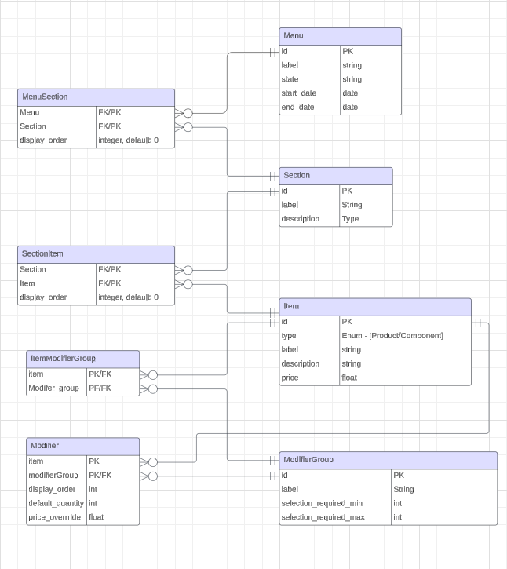

# Atlas Backend

This project is designed to manage a complex database schema for a menu management system. It leverages Sequelize, for interacting with a PostgreSQL database. This setup allows for robust management of relationships between menus, sections, items, modifiers, and modifier groups.

## Running live @ https://atlas-graphql.onrender.com/graphql
As it is deployed on a free tier request may take time to process due to cold starts. 

## Relationships


The database schema is designed with the following relationships:

- A **Menu** has many **Sections** through `MenuSection`.
- A **Section** has many **Items** through `SectionItem`.
- An **Item** belongs to many **Sections** through `SectionItem`.
- A **Modifier** belongs to an **Item** and a **ModifierGroup**.
- A **ModifierGroup** has many **Modifiers**.

## Tech Stack

- **Backend:** Node.js
- **Database:** PostgreSQL
- **ORM:** Sequelize

## Hosting

The database is hosted on Supabase.
The server is hosted on Render.

## Setup

### Requirements

- Node.js
- npm or yarn
- PostgreSQL

### To run locally

1. Clone the repository:
2. Install dependencies: `npm install`
4. `cd ./src`
4. run migration - `npx sequelize db:migrate`
5. run seeder - `npx sequelize db:seed:all`
6. run `npm start`

### Available Querys 
Query All Menus
```
query {
    menus {
        id
        label
        sections {
            id
            label
            items {
                id
                label
                description
                modifierGroups {
                    id
                    modifiers {
                        displayOrder
                        item {
                            id
                            label
                        }
                    }
                }
            }
        }
    }
}
```

Query Menu by Id
```
query {
    menu (id) {
        id
        label
        sections {
            id
            label
            items {
                id
                label
                description
                modifierGroups {
                    id
                    modifiers {
                        displayOrder
                        item {
                            id
                            label
                        }
                    }
                }
            }
        }
    }
}
```
similar query functions are available for the other entities.

### Mutations

#### Create Ranch as a product
```
mutation {
  createProduct(
    label: "Ranch sauce",
    description: "Tangy sauce",
    price: 2.00
  ) {
    id
    label
    description
    price
  }
}
```
#### Create an association for Ranch with Sauce ModifierGroup
```
mutation {
  createModifierAndAssociate( 
        priceOverride: 1.00,
        defaultQuantity: 0,
        displayOrder: 0,
        modifierGroupId:<modifierGroupId>,
        itemId: <item.id>
        ) {
        priceOverride
        defaultQuantity
        displayOrder
        modifierGroupId
        itemId
        }
    }
```
#### Associate an item and modifierGroup
```
mutation {
  associateItemModifierGroup(
    itemId: <item.id>
    modifierGroupId: <modifierGroupId>
  )
}
```


Several other mutations have been defined such as updateModifierGroup, deleteModifierGroup, createComponent, updateItem and deleteItem. 

### Considerations and Improvements

There are several considerations and potential improvements that can enhance the functionality, integrity, and user experience of the application.

#### Display Order

- **Enforcement and Uniqueness:** Implementing backend logic to enforce a sequential display order and uniqueness for items within menus and sections.
- **Database Constraints:** Adding unique constraints to the combination of `[displayOrder, MenuId, SectionId]` in the database schema can help maintain data integrity. This prevents duplicate entries and ensures that each item within a section of a menu has a unique position.

#### Menu Item Listing

- **Restrictions on Item Types:** To ensure the menu remains clear and functional, it's important to enforce restrictions on what types of items can be added to it. Specifically, only products should be listable as menu items, not components or raw materials. This helps prevent erroneous additions that could confuse customers or staff.
- **Modifier Groups Constraints:** Creating a database constraint that only products can have associated `ModifierGroups` ensures that modifiers are only applied where relevant. This not only simplifies the management of items and their modifiers but also enhances the clarity of the menu for end-users.


